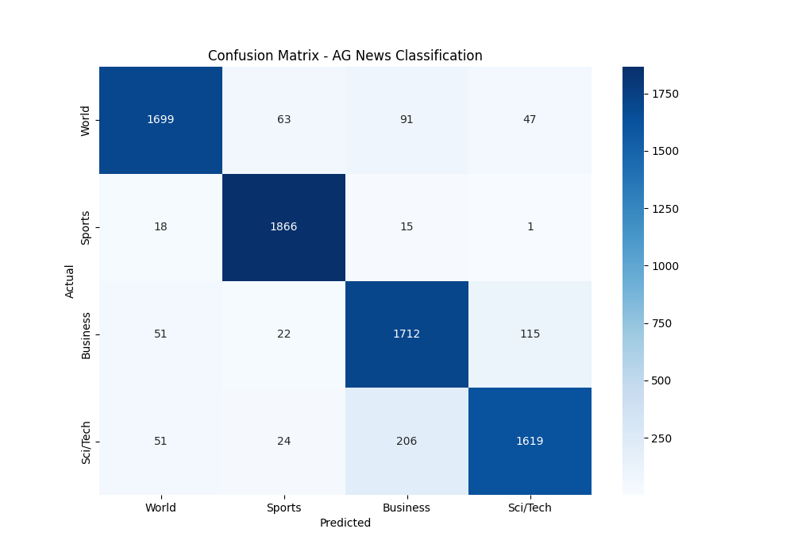

# PyTorch Text Classification (AG News)

This project implements a simple neural network using PyTorch to classify news articles into four categories: World, Sports, Business, and Science/Technology. It follows a complete beginner-friendly workflow for training deep learning models.


## 🚀 Features
- **Dataset:** Uses the AG News dataset (120k training samples).
- **Preprocessing:** Tokenization using `bert-base-uncased` via Hugging Face.
- **Model:** A custom PyTorch `nn.Module` with an Embedding layer, a Hidden Linear layer (ReLU), and an Output layer.
- **Optimization:** Adam Optimizer with Cross-Entropy Loss.

## 📊 Results & Evaluation

The model's performance was evaluated using a Confusion Matrix to identify specific classification challenges.



### Analysis
- The model performs exceptionally well on **Sports** news.
- Most errors occur between **Business** and **Sci/Tech**, which is expected as these topics often overlap in modern journalism.

## 🛠️ Installation & Setup
1. Clone the repository:
   ```bash
   git clone [https://github.com/YOUR_USERNAME/YOUR_REPO_NAME.git](https://github.com/YOUR_USERNAME/YOUR_REPO_NAME.git)
   cd YOUR_REPO_NAME
